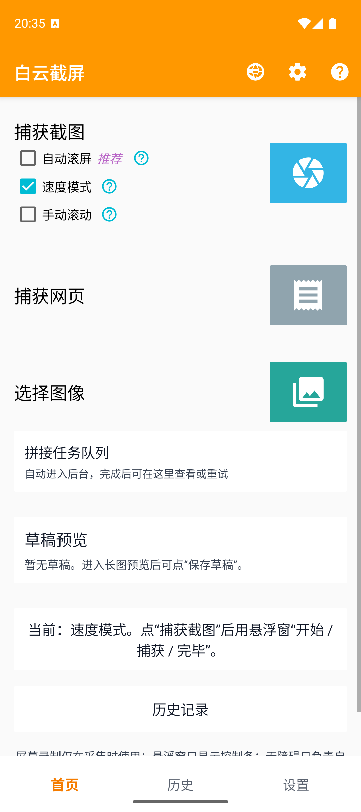

# WhiteYun Screenshot

[简体中文](README.md) | English

WhiteYun Screenshot is an Android app for capturing and stitching long screenshots. It is designed for chat histories, webpages, automatically or manually scrolled content, and existing groups of images.

The goal is simple: capture, scroll, stitch, preview, and save in one workflow, instead of taking a dozen screenshots and later guessing how they fit together.

## Project background: rebuilding from LongScreenShot

WhiteYun Screenshot was inspired by [LongScreenShot](https://github.com/zengfw/LongScreenShot). I originally used it to preserve very long WeChat conversations as a single image. As it became less suitable for newer Android versions, I decided to rebuild the app.

The familiar frontend style draws from LongScreenShot, but the implementation was rewritten. Screen capture, automatic scrolling, image stitching, webpage capture, multi-image processing, background task queues, previews, drafts, and history were redesigned and implemented for this project rather than carried over from the old code.

## What it can do

<p>
  
  
  
  
  
  
  
</p>

### Turn a scrolling screen into one image

Use the floating controls to start capture, scroll through the content, and finish when you are done. Automatic scrolling works well for chats, articles, and lists. Speed mode is useful for predictable content, while manual mode gives you control over complex or slow-loading screens.

### Capture full webpages

Enter a URL or search term, choose where to start and stop, and capture the page beyond the visible viewport. The app also provides an option to remove sticky webpage elements, reducing repeated navigation bars and floating content in the result.

### Stitch screenshots you already have

Select existing images and send them directly to the stitching queue. There is no need to capture the content again.

### Keep long-running work in the background

Stitching jobs run through a background queue and can be viewed or retried. Results go to preview before being saved, with separate entries for drafts and history.

## Features

- Automatic scrolling, speed mode, and manual scrolling.
- Floating controls for starting, capturing, and finishing without repeatedly returning to the app.
- Webpage capture from a URL or search term, with configurable start and end positions.
- Removal of sticky webpage elements to reduce repeated fixed navigation.
- Stitching of multiple existing images.
- Background stitching queue with job status and retry support.
- Long-image preview, drafts, gallery saving, and history.
- Help and feedback screen with version, device, and permission status.
- Diagnostic log export for troubleshooting device-specific problems.

## Localization

WhiteYun Screenshot follows the device's system language by default. The A/文 translation button in the home toolbar opens the language picker directly; you can also switch language from **Settings** inside the app.

The app includes 19 languages:

- English
- Simplified Chinese
- Traditional Chinese
- Spanish
- French
- German
- Brazilian Portuguese
- Russian
- Japanese
- Korean
- Arabic
- Hindi
- Indonesian
- Italian
- Turkish
- Vietnamese
- Thai
- Polish
- Dutch

Localization works fully offline at runtime. The launcher name follows the system or selected app language, while the original WhiteYun cloud-and-long-screenshot mark is preserved and shaped by each device launcher. Community review and corrections are welcome, especially from native speakers.

## Build from source

This is a standard Android project with the package name `com.whiteyun.screenshot`. It uses Java and native Android Views and requires Android 10 (API 29) or later.

```powershell
.\gradlew.bat :app:assembleDebug
```

The debug APK is generated at:

```text
app/build/outputs/apk/debug/app-debug.apk
```

The app has been installed and launched on a Google Pixel 9 emulator with Google Play and Android API 36. The home, settings, help and feedback, history, and webpage capture screens were checked there; this is not a claim of comprehensive device or language testing.

## Permissions

- **Screen recording:** used only while capturing screen content.
- **Display over other apps:** shows the floating capture controls.
- **Accessibility service:** performs scrolling only when automatic scrolling is enabled.
- **Notifications:** reports the status of background stitching jobs.
- **Image access and saving:** uses the system picker and media library for images you choose and results you save.

Permissions are requested for the features that need them. Their current status is available on the Help and Feedback screen.

## License

This project is licensed under the MIT License. See [LICENSE](LICENSE).
