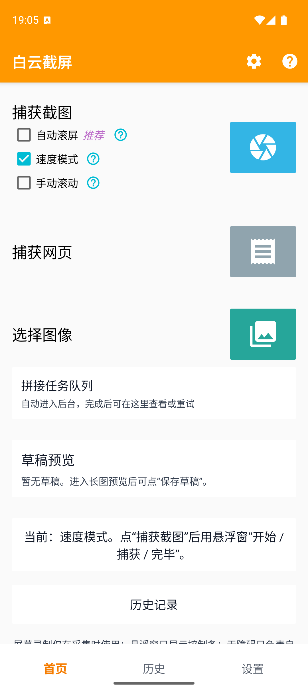
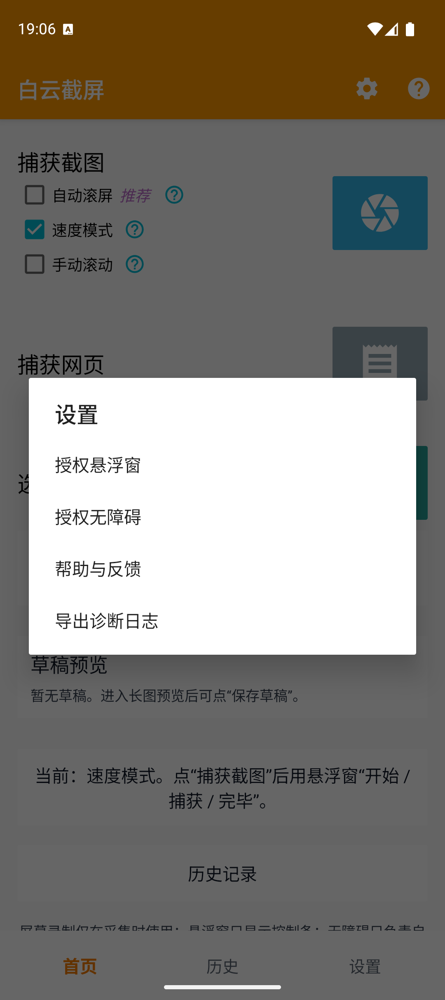
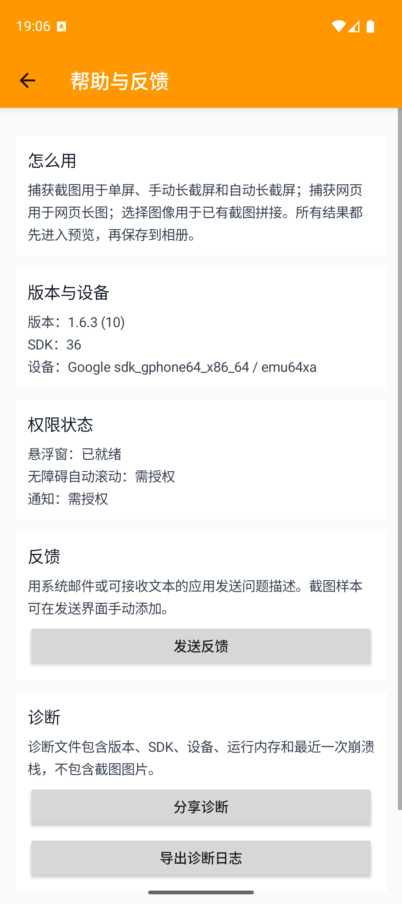
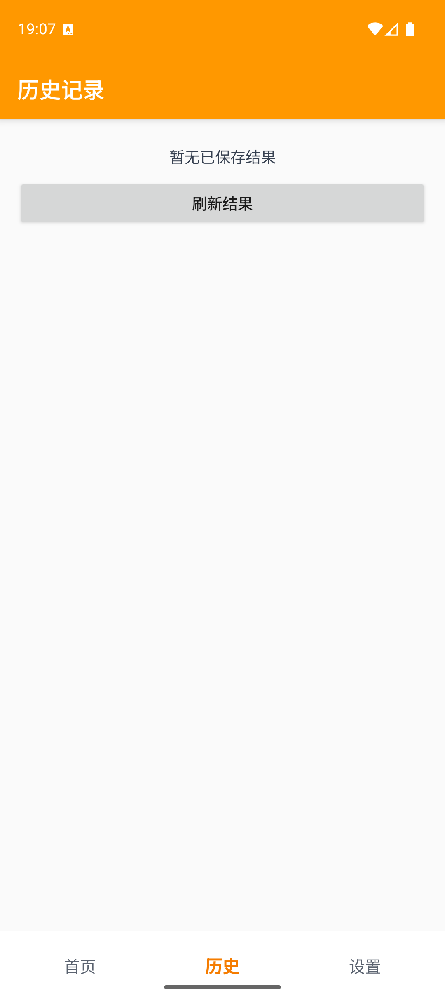
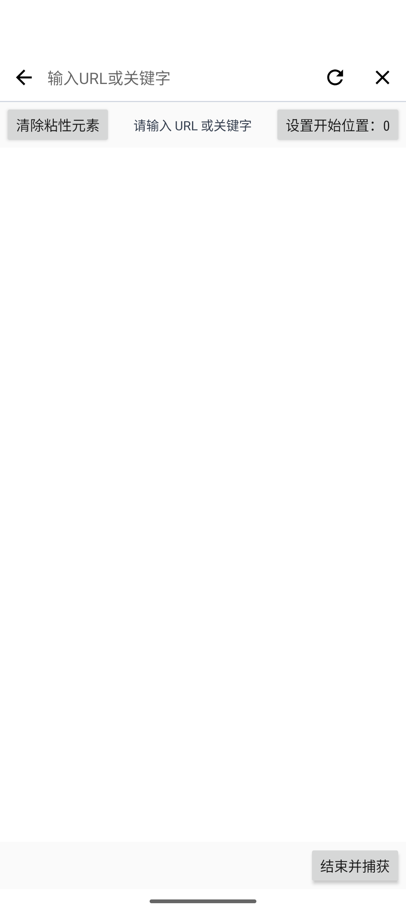
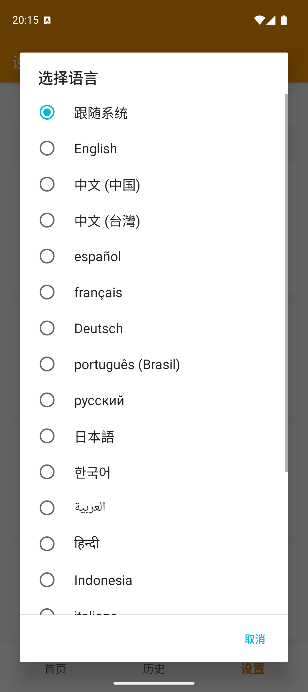

# 白云截屏

简体中文 | [English](README.en.md)

白云截屏（WhiteYun Screenshot）是一款 Android 长截图工具（Android long screenshot app），面向微信聊天记录、网页长图、自动滚屏、手动长截屏和多图拼接等场景。

我做这个东西的原因很简单：手机上的内容越来越长，但系统截图还停在“一屏一张”。聊天记录、网页、教程、订单、文章，真正需要保存的时候，往往不是屏幕上露出的那一截，而是从头到尾完整的一段。

白云截屏就是把这件事做好：捕获、滚动、拼接、预览、保存，一条链路走完。你不用再截十几张图，然后对着相册猜哪两张应该接在一起。

## 项目渊源：从龙班截屏重新做起

白云截屏是基于[龙班截屏](https://github.com/zengfw/LongScreenShot)而来的，但这个“基于”需要解释一下。

我最早是龙班截屏的用户，主要拿它截取超长的微信聊天记录，再把整段聊天合并成一张图。那时候需求很具体：聊天记录太长，分屏截图不方便，最好一次把上下文完整留下来。又过了几年，龙班截屏逐渐不再适合高版本 Android 设备，于是我开始想，能不能把这个 APP 重新做出来。

所以白云截屏在前端页面样式上确实借鉴了龙班截屏。说得直白一点：龙班截屏几乎只借鉴了前端页面样式，其他全部都是重新写的。屏幕采集、自动滚动、拼接算法、网页长图、多图处理、后台任务队列、预览、草稿和历史记录，都不是把旧代码换个名字继续用，而是重新设计、重新实现。

中间我似乎找到过龙班很久以前的一份开源代码，本来以为终于能对上那个不适配高版本安卓的旧版本龙班，核对之后才发现，并不是。这个线索没有把事情变简单，反而让我确认了一件事：熟悉的页面可以保留，但真正的产品要重新做。

## 先看它能做什么

<p>
  
  
  
  
  
  
</p>

### 一张屏幕，直接变成长图

打开悬浮窗，点开始，让内容自然滚动，最后点完毕。自动滚屏适合聊天记录、文章和列表；速度模式适合你已经知道内容变化规律、想尽快跑完的场景；手动滚动则把每一步交给自己，遇到复杂页面也不至于只能看运气。

这三种模式不是为了把按钮做多，而是因为不同页面根本不是同一种东西。规则整齐的页面可以交给自动化，动画多、加载慢、容易误触的页面，人工反而更稳。

### 网页长图，不只截屏幕上那一块

网页入口可以输入 URL 或关键词，再设置开始位置和结束位置。页面里的悬浮元素、粘性导航会影响最终结果，工具提供清除粘性元素的处理入口，尽量让长图留下真正有用的内容。

这背后的思路其实很朴素：网页本来就是一张可以滚动的长画布，截屏只是把它按当前窗口切成很多片，再重新拼回去。白云截屏做的，是把中间那些重复、错位和不该入图的东西尽量处理掉。

### 已经有很多截图？直接拼

选择图像可以把现有截图交给拼接流程。临时从别的应用拿来的图片、之前截好的几段内容，不需要重新滚一遍，选中后交给拼接任务队列即可。

### 长任务放到后台，结果不会凭空消失

拼接任务会进入后台队列，完成后可以查看、重试；结果先进入预览，再保存到相册；草稿和历史记录也有单独入口。这样即使一次操作比较慢，也不需要一直盯着进度条，更不用担心中途切出去以后找不到刚才的结果。

## 我觉得它真正有用的地方

很多截图工具只负责“按下快门”。白云截屏往前多走了一步：它把采集方式、拼接过程和结果管理放在一起。

你可以把它当成聊天记录保存器，也可以当成网页归档工具、教程制作工具，或者只是一个把零散图片整理成一张长图的小工具。功能听起来不复杂，但真正用起来，省掉的是那些很碎的动作：来回滚动、反复截屏、切换相册、调整顺序、确认有没有漏掉一段。

说白了，它不是把“截图”这两个字变得多高级，而是把截图之后那一堆麻烦事一起收拾了。

## 能力清单

- 自动滚屏、速度模式、手动滚动三种采集方式。
- 悬浮窗控制开始、捕获和完毕，不用反复切回应用。
- 网页长图入口，支持 URL 或关键词、开始位置和结束捕获。
- 清除网页粘性元素，降低固定导航重复出现在长图里的概率。
- 选择多张已有图片进行长图拼接。
- 后台拼接任务队列，支持查看和重试。
- 长图预览、草稿保存、相册保存和历史记录。
- 帮助与反馈页面，显示版本、设备和权限状态。
- 诊断日志导出，方便排查具体设备上的问题。
- 默认跟随系统语言，也可以在应用的“设置”中随时切换界面语言。

## 多语言

白云截屏默认识别并跟随 Android 系统语言。进入应用后，也可以在 **设置 → 切换语言** 中单独选择界面语言；选择“跟随系统”即可恢复自动识别。

目前包含 19 种语言：英语、简体中文、繁体中文、西班牙语、法语、德语、巴西葡萄牙语、俄语、日语、韩语、阿拉伯语、印地语、印度尼西亚语、意大利语、土耳其语、越南语、泰语、波兰语和荷兰语。

所有界面翻译均随应用打包，运行时无需联网。欢迎母语使用者提交校对与措辞改进。

## 从源码构建

项目是一个普通的 Android 工程，包名为 `com.whiteyun.screenshot`，使用 Java 和原生 Android View，最低支持 Android 10（API 29）。

```powershell
.\gradlew.bat :app:assembleDebug
```

生成的调试 APK 位于：

```text
app/build/outputs/apk/debug/app-debug.apk
```

我已经在 Google Pixel 9 模拟器（Google Play、Android API 36）上完成安装启动，并实际走过首页、设置、帮助与反馈、历史记录和网页长图入口。

## 权限说明

- 屏幕录制：只在采集屏幕内容时使用。
- 悬浮窗：显示采集控制条。
- 无障碍服务：只在自动滚屏时帮助执行滚动。
- 通知：用于后台拼接任务的状态提示。
- 图片访问与保存：通过系统文件选择器和媒体库处理你主动选择的图片与长图结果。

权限是工具链的一部分，不是越多越厉害。白云截屏只在对应功能需要时使用它们，具体状态可以在帮助与反馈页面查看。

## 许可证

本项目使用 MIT License，见 [LICENSE](LICENSE)。
